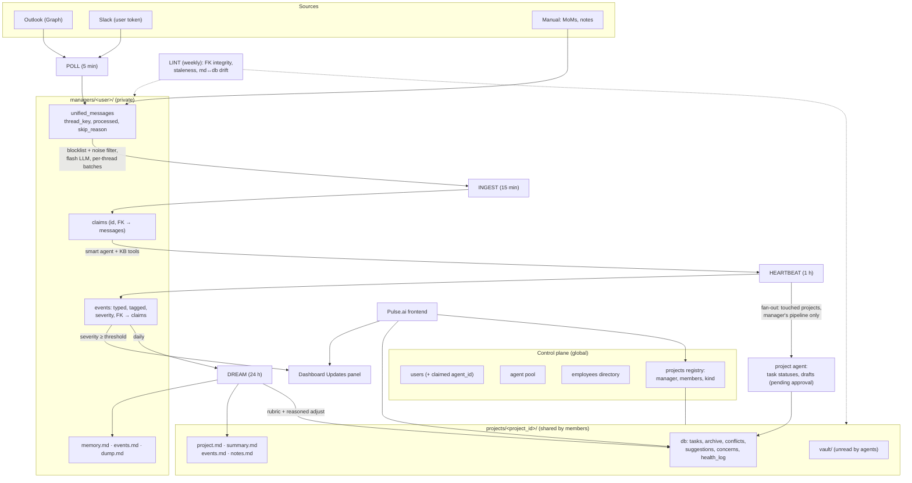

# Pulse.ai Architecture v2 — Knowledge Base & Job Pipeline

Status: **v2 design, agreed direction 2026-07-22** (vocabulary, blocklist +
noise filter, db-as-truth/md-as-synthesis, health rubric, manager-only
project truth, global projects registry — all confirmed by Shivam).
Designed from the product description, NOT from the existing code — the old
code was built under a different (demo-simulator) philosophy. Existing code
is consulted only at implementation time, per step, to decide what to
reuse vs delete (see Appendix A). The OAuth/connector/agent-pool layer is
built and tested and carries over as-is.

---

## 1. Product model

- **User**: any employee in the org. Logs in with Outlook; first login
  creates their `user_id`. A user can be a worker on some projects and the
  manager of others — "manager" is a per-project role, not a user type.
- **Agent**: a pooled Slack bot. Admin pre-creates the apps and stores their
  credentials; a user claims exactly one available agent with a fixed
  secret code given out by the admin. The user table records the claimed
  `agent_id`; an unclaimed agent has `user_id = NULL`. (Built: Step 17.)
- **Connectors**: per-user Outlook + Slack grants; access/refresh tokens
  stored against the user. (Built.)
- **Project**: shared work with a team, one primary manager, optional
  supervisors. **Task**: a personal project — identical structure, no team
  (`kind="personal"`, members = [owner]). One codepath, one storage shape.
- **The KB's job**: power (a) the project-tracking dashboard and (b) the
  personal agent later. It must answer audit questions ("why did we pivot",
  "what did X do", "what happened in that meeting") with citations down to
  source messages.

## 2. Vocabulary (standardized — use in schema, code, and UI)

```
message  →  claim  →  event  →  notification
```

- **message**: raw item in the unified store (mail, slack message, manual
  MoM). Immutable once stored. Unique id.
- **claim**: short structured statement extracted from message(s) by the
  ingest job (flash model). FK → source message(s). Unique `claim_id`.
- **event**: condensed, *judged* output of the heartbeat agent. Typed
  (`status_update | blocker | clarification | commitment | request |
  conflict | fyi`), tagged (`project_ids[] / task_ids[] / general`),
  severity 0–3. FK → claims.
- **notification**: NOT a table — an event with `severity ≥ threshold`
  (plus explicit user promote/dismiss overrides). The dashboard Updates
  panel is a query over events.
- Blockers, commitments, clarifications, requests, conflicts are **typed
  events**, not separate subsystems. Conflicts additionally pair the two
  contradicting claims in the project's `conflicts` table; severity
  attached; **never auto-resolved**.

## 3. Storage

Two rules, both confirmed:

1. **SQLite is the source of truth for anything structured; markdown is
   the synthesis/audit layer and always regenerable from the db.** A lost
   md file is a rebuild, never data loss.
2. **Every md file has exactly one writer job.** No concurrent writers.

```
data/controlplane.sqlite            # GLOBAL
  users            user_id, email, name, agent_id (nullable), created_at
  agents           pool: creds/tokens, user_id nullable = unclaimed   [built]
  connections      per-user Outlook/Slack installations               [built]
  employees        org directory: employee_id, email, slack_id, name,
                   role, skills          (admin seed script now; Graph
                   directory sync later)
  projects         project_id, name, description, kind (team|personal),
                   manager_user_id, supervisors, created_at
  project_members  project_id, employee_id, role

managers/<user_id>/                 # PER USER (isolation layer — built)
  db.sqlite
    unified_messages   id, source (outlook|slack|manual), provider_message_id,
                       thread_key, channel_id, channel_type (dm|group|channel),
                       sender, recipients, sent_at, body, fetched_at,
                       processed (bool), skip_reason (null|blocked|noise)
                       UNIQUE (source, provider_message_id)
    claims             claim_id, text, thread_key, content_hash, created_at,
                       processed (bool)      + claim_sources (claim_id, message_id)
    events             event_id, type, severity, title, body, project_ids,
                       task_ids, created_at, dreamed (bool),
                       ui_state (shown|dismissed|promoted)
    todos              user-maintained TODO list (dashboard panel; no LLM)
  memory.md            writer: dream — durable facts about the user
                       (Hermes-style), incl. notification-preference notes
  events.md            writer: dream — datestamped personal log
  dump.md              writer: dream — reference dump (contacts, ids,
                       feature descriptions); RAG target later

projects/<project_id>/              # PER PROJECT — global, NOT under a user
  db.sqlite
    tasks            task_id, parent_task_id (subtasks), title, description,
                     assignee_employee_id, status (todo|in_progress|blocked|
                     done|pending_approval), due, created_by (manager|agent),
                     approved_by, timestamps
    archive          append-only timestamped record of every project event,
                     MoM, action taken — full lifecycle audit trail
    conflicts        claim-pair refs, severity, status (open|resolved_by_human)
    suggestions      dream-generated; shown on project page (new UI surface)
    concerns         dream-generated; shown on project page (new UI surface)
    health_log       ts, rubric_inputs (json), base_score, llm_adjustment,
                     reason
  project.md         writer: manager via UI — name, overview, milestones, KPIs
  summary.md         writer: dream — agent-loadable state of the project
  events.md          writer: dream — timestamped key events (powers the
                     timeline flowchart, wireframe 7)
  notes.md           writer: manager/agent — special instructions, references
  vault/             file dump ("Project Vault" in wireframes). Agents do
                     NOT read it in v2.
```

### 3.1 Why projects are global (confirmed)

Teammates' dashboards show project task statuses, so project data is
shared — it cannot live inside one user's private directory. The
control-plane `projects` registry + `projects/<id>/` directory make
membership-based reads natural, and give two free wins:

- **Manager handover**: reassign `manager_user_id` in the registry; the
  project's entire history stays put because the store is project-scoped,
  not user-scoped.
- **Personal tasks are private by construction**: `kind="personal"`,
  members = [owner] — no special-casing anywhere.

**Write authority (confirmed)**: only the *manager's* pipeline synthesizes
project truth. Teammate↔teammate DMs contribute nothing; teammates' own
agents have no say in project management. Only conversations involving the
manager (and, later, teammate↔manager's-agent conversations) feed the
project KB. Known blind spot, accepted for v2.

### 3.2 Manual inputs (MoMs, pasted notes)

Minutes of meetings and similar manual additions enter as
`unified_messages` rows with `source="manual"` (frontend endpoint). They
flow through the exact same claim → event pipeline — no side channel, same
citations, same audit trail.

## 4. Background services (one global scheduler, intervals configurable)

The scheduler iterates all provisioned users per tick. Jobs are
**transactionally idempotent**: output rows commit + processed flags flip
in one transaction; retries dedupe via `content_hash` / unique ids.

### 4.1 Poll (5 min) — deterministic, no LLM
Per connected user: fetch new Outlook mail + Slack messages (DMs **and**
groups/channels the user is in) since the per-user cursor. Store with
thread identifiers (`thread_key` = Outlook `conversationId` / Slack
`channel_id + thread_ts`) so long mail threads and group chats stay
linkable. Store everything fetched (immutable record); filtering happens
at ingest selection, so editing the blocklist never loses history.

### 4.2 Ingest (15 min) — flash model, de-noise → claims
Selection: unprocessed messages, minus
1. **user blocklist** — track-everything-except: fnmatch patterns over
   email/slack ids, user-managed from the frontend (replaces the old
   allowlist philosophy);
2. **built-in noise filter** — no-reply senders, calendar accept/decline
   stubs, bulk-mail headers, Slack join/leave messages.
Skipped rows are marked `processed` with a `skip_reason` — auditable, and
never re-scanned.

Survivors are batched **per thread** (claims like "Alice agreed to the new
deadline" need thread context), sent to the flash model with timestamps,
source, sender/receiver metadata. Output: short structured claims, each
citing its source message ids. Cap batch size per run; skip the LLM
entirely on zero pending.

### 4.3 Heartbeat (1 h) — smart agent, claims → events, project fan-out
Per user with unprocessed claims: an agent with context (user profile,
project memberships, recent events, memory.md) and KB-inspection tools
converts claims into **events** — typed, tagged with project/task ids or
`general`, severity-scored. Severity doctrine: routine progress ("x
finished y") is low/no-notification unless history marks it important;
blockers/clarifications are at least low; approvals land as low;
urgent-pending-training or repeated-unanswered-outreach are critical.
(The dismiss/promote → memory feedback loop is scaffolded in the schema
now — `ui_state`, memory.md preference section — and engineered later,
alongside agent context work, while testing heartbeat.)

Then **fan-out, only for projects that received new events and only where
this user is the project's manager**: a project-scoped agent run updates
task statuses, drafts new tasks/subtasks as `pending_approval` (manager
approves in the UI — an approvals surface gets added to the project page),
and appends to the project archive.

Context-explosion valves: cap claims per run (overflow waits for the next
tick), skip users with zero pending, fan out only to touched projects,
project agents load `summary.md` + queried excerpts — never the whole
archive.

### 4.4 Dream (24 h) — smart model, synthesis
Per user: the day's events → update `memory.md`, personal `events.md`,
`dump.md`.
Per managed project: regenerate `summary.md`; append key events to project
`events.md`; generate **suggestions** and **concerns**; compute **health**.

Health is auditable, not vibes: a deterministic rubric in code (open
blockers, overdue tasks, unresolved conflicts, days since last progress
event, milestone slippage vs project.md) produces a base score; the LLM
may adjust ±1 band **with a written reason**. Both land in `health_log`.
"Why is this project red?" always has a citable answer.

### 4.5 Lint (weekly) — deterministic integrity, optional LLM pass
Every claim's message FKs resolve; every event's claim FKs resolve; no
orphaned conflict/suggestion/task references; staleness flags (files or
projects untouched for N days); md-regeneration check (every citation in
generated md resolves to a live row). An optional LLM coherence pass is
additive, never a replacement.

## 5. Dashboard ↔ data map

| Widget (wireframes) | Backed by |
|---|---|
| Updates panel, color-coded | events where `severity ≥ threshold`, minus dismissed, plus promoted |
| TODOs | `todos` table, user-maintained, no LLM |
| Tasks section | projects registry `kind="personal"` for this user |
| Projects cards + health | registry membership + `health_log` latest |
| Project page: tasks/statuses | project `tasks` |
| Project blockers & clarifications | events typed `blocker`/`clarification` tagged to the project |
| Conflicts | project `conflicts` |
| Suggestions / concerns (new surface) | project `suggestions`/`concerns` |
| Timeline flowchart (wireframe 7) | project `events.md` / archive |
| Project Vault | `vault/` listing + upload |
| Approvals (new surface) | tasks with `status="pending_approval"` |
| Workload (per user) | computed join: registry membership × task assignments — computed view, not stored |

## 6. Scenario walk-throughs (first-principles checks)

- **Admin mails "complete your certification"** → poll → survives filters
  → claim → heartbeat event `type=request, general, severity=high if
  deadline near` → Updates panel red/amber. Belongs to no project: fine,
  `general` tag exists for exactly this.
- **User prepping a presentation** → creates a Task (personal project) →
  same md files + tasks table, no team; agent tracks steps, stakeholders
  live in notes.md/dump.md.
- **Bob→manager: "sent the file"; Alice→manager: "never got it"** → both
  claims in the manager's pipeline → heartbeat pairs them → conflict event
  + `conflicts` row, severity set, surfaced on project page. Never
  auto-resolved.
- **Bob→Alice DM, manager not involved** → invisible to project truth by
  design (confirmed). Their own personal agents saw it; project KB does not.
- **Same group message polled by 3 members** → 3 private copies in 3 user
  stores; only the manager's copy can influence the project KB → no
  cross-user dedup problem exists.
- **Long mail thread over weeks** → `thread_key` groups it; ingest batches
  per thread; claims cite the exact messages.
- **Manager replaced** → registry points at the new manager; project store
  unmoved; new manager's heartbeat takes over synthesis.
- **User with no projects** → purely personal assistant: general events,
  personal tasks, memory/dump — pipeline unchanged.
- **Job crash mid-run** → transactional flags: nothing marked processed
  without its outputs committed; rerun is safe; hashes prevent duplicates.
- **Noisy day (500 messages)** → ingest caps per run and drains over
  successive ticks; heartbeat caps claims per run; dashboards lag minutes,
  never corrupt.

## 7. Implementation order (each becomes a step prompt)

1. **Registry & scaffold** — control-plane `employees` (+ seed script),
   `projects` + `project_members`; `projects/<id>/` scaffold (db + md
   templates + vault). CRUD APIs for the frontend (create project, members).
2. **Per-user KB schema** — claims/events/todos tables, thread_key +
   skip_reason on messages; blocklist (invert allowlist storage, keep
   fnmatch) + noise filter + management API.
3. **Poll completion** — Slack groups/channels (today DM-only), Outlook
   `conversationId` capture, `source="manual"` MoM endpoint.
4. **Ingest** — real implementation per §4.2. TDD.
5. **Heartbeat (user level)** — claims → events. TDD with canned LLM.
6. **Heartbeat (project fan-out)** — project agent, pending-approval tasks,
   archive writes.
7. **Dream** — user md files; project summary/events/suggestions/concerns/
   health rubric.
8. **Lint** — integrity checks.
9. **Frontend wiring** — dashboard home (Updates/TODOs/Tasks/Projects),
   then project pages, as wireframes are worked through.

Sim-time note: all jobs read the sim-time service, as before — the demo
clock still drives everything.

---

## Appendix A — reuse inventory (consulted per step, not load-bearing for the design)

Carried over untouched: Outlook OAuth login, connectors + token storage,
agent pool claim flow, per-user directory isolation, global scheduler
skeleton with the four job slots, sim-time service, poll jobs (extended in
step 3).

Evaluated at implementation time, delete-or-mine per step: `app.kb`
(Entity/compiled-truth/extraction/synthesis — prototype code for steps
4–7), `app.projectkb.models`+`paths` (early per-project sqlite/md sketch —
raw material for step 1), `tracked.py` allowlist (inverted in step 2),
v1-era `spec/feature_*.md` (archive when their subject is reworked), old
Vue dashboard `app/static/dashboard/` (retire as `frontend/` replaces its
surfaces). The simulator stays.

## Appendix B — architecture diagram


